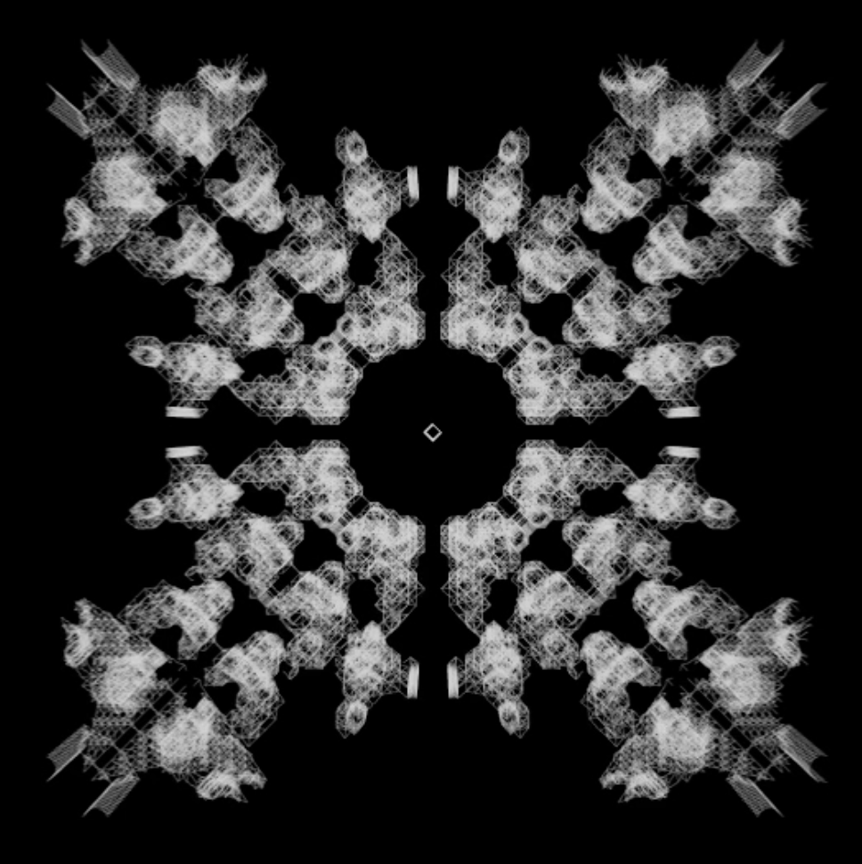

# cgol_gen_stack
Visualizer for Conway's Game of Life with the option of stacking the history generations as 3d voxels or lines 

Implemented in [OpenFrameworks](https://openframeworks.cc/)

## Usage
- Add sourcefiles to a fresh Openframeworks app and build it.
- press 'r' in any mode to run/stop the progession
- press 'space' to go step to next generation
- App starts in drawing mode (press 'd' to go to drawing mode)
  In drawing mode:
    - click and drag with mouse to draw seed pattern, (left button turns cells alive, right dead)
    - '+' and '-' to change canvas size
    - 'b' to reset canvas
    - 'm' for noise
    - '1' and '2' for cross patterns

- press 's' to go to voxel stacking mode, it displays all generations as stacked voxels
- press 'l' to go to lines mode, it draws a line for each cell to its parents of the previous gen
  In lines mode:
    - 'e' to export line structure as .obj file. File gets stored in bin/data directory

In both 3d modes:
- 'x' to reset history
- 'o' to switch to a orthographic camera projection (a bit of zooming in still necessary)
- 'p' to switch back to a perspective camera projection
- '9' to lock and unlock camera to a centered position looking on the canvas 

Here the [Documentation](https://benjaminbak.github.io/Portfolio/projects/cgol1/index.html).
